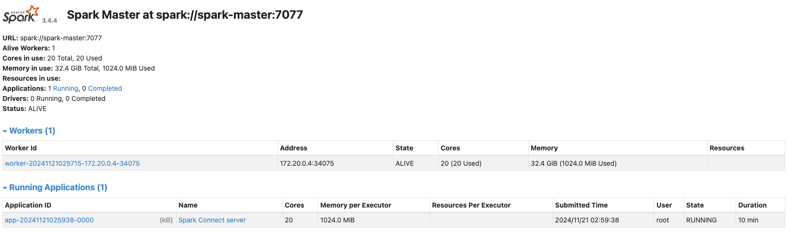
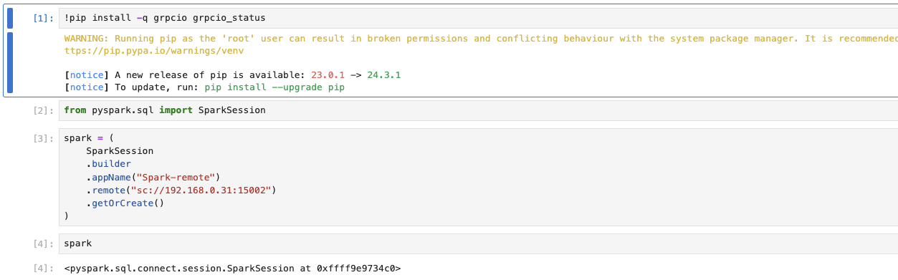
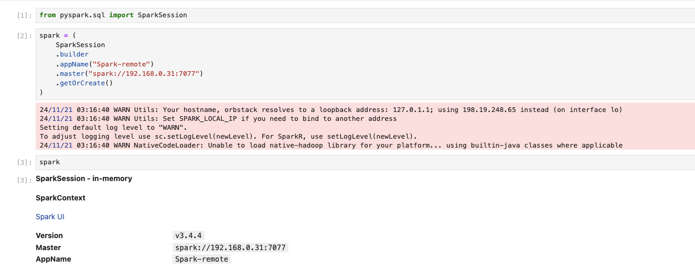
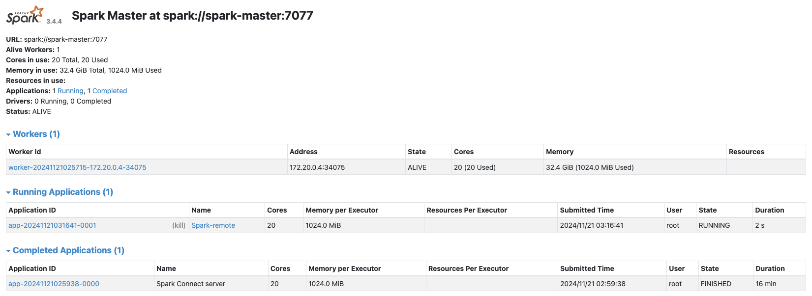

# 利用Docker建構Spark集群 Spark with Docker

## 前置準備

在使用Docker建構Spark集群前，請確保以下工具已安裝完畢：

* Docker
* Docker Compose

此外，建議具備有Docker網路以及相關基礎知識，再進行Spark集群建構。

## 建立Docker映像檔案 (可以略過)

為了建構Spark集群，首先我們需要建立一個Docker映像檔案。請使用下方的指令來進行映像檔的建立：

```
docker build -t <image name>:<image tag> . -f Dockerfile
```

在建立映像檔案時，請確保以下的檔案存在，以免造成錯誤：

* `entrypoints.sh`
* `.env.spark`
* `config/spark-default.conf`
* `requirements.txt`

> 由於我們在後續的`docker-compose.yaml`中使用了`build-context`的功能，可以直接讀取指定的映像檔案設定並進行映像檔的建構，故本步驟可以跳過。

## Dockerfile解說

在`Dockerfile`中執行的建構流程，主要有：

* 指定基礎映像檔，並進行必要工具的下載以及安裝
* 設定環境參數，下載Spark檔案，並安裝
* 設定Spark並進行後續Python設定
* 設定容器啟動時的執行檔案

## Entrypoints.sh介紹

`entrypoints.sh`主要提供利用不同參數來使啟動的容器擔任不同功能的指令。以下是可用的指令以及對應的解釋：

* `master`：使用此參數來進行容器啟動，將會啟動作為主節點的容器
* `worker`：使用此參數來進行容器啟動，將會啟動作為執行節點的容器
* `history`：使用此參數來進行容器啟動，將啟動記錄Spark運作歷史的容器

## 啟動集群

藉由準備好的`docker-compse.yaml`，我們可以迅速地建立一個Spark集群。在建立集群前，請先將`spark-master`的`ports`設定修改，將`<your host IP>`設定成個人裝置的IP，避免建構失敗。

以下是建立集群的指令：

* 預設（一個主節點、一個執行節點）

```
docker-compose up -d
```

* 進階（一個主節點及多個執行節點）

```
docker-compose up -d --scale spark-worker=3
```

## 使用範例

* Cluster運作模式+PySpark

如果需要使用Cluster模式，搭配PySpark來進行互動，需要先建立一個中轉容器，用以轉發PySpark所提交的任務。

首先，我們需要額外建立一個容器，並在容器內啟動`spark-connect-server`:

> 這邊假設使用先前建立的映像檔

```
docker run -it --network host --entrypoint="/bin/bash" <image name>:<image tag>
```

然後，在容器內執行以下指令：

```
start-connect-server.sh \
    --master spark:<your spark master ip>:<your spark master port> \
    --packages org.apache.spark:spark-connect_2.12:3.4.4 
```

觀察`spark-master`容器的`9090`連接埠所提供的網頁，可以注意到一個運作中的服務，此服務即為`spark-connect-server`所運作的服務。

接下來，我們可以在外部啟動一個Jupyuter lab，並透過此`spark-connect-server`所提供的中轉，進行Spark的運作：



```
docker run -it --network host --entrypoint="/bin/bash" <image name>:<image tag>
```



* Client運作模式+PySpark

我們也可以直接使用剛剛啟動的Jupyter lab，以Client模式進行運作。只要將Spark的連線改為以下的樣式即可：



同樣的，我們可以觀察網頁來確認新的連線：



可以注意到，有一個欄位是`Spark-remote`的連線，此連線就是我們剛剛建立的連線。

## Docker Compose設定

### 網路連線以及連接埠

在目前版本中，我們使用`spark-network`作為集群的預設網路。為確保服務可以被其他裝置，以及Docker網路外的連線所存取，我們為主節點的容器新增了帶有`<ip>:<host port>:<container port>`的設定。此設定將會將連接埠與宿主機的連接埠做綁定，請視需求進行修改。

## 注意事項

### Spark EventLog

在目前的版本中，`spark.eventLog.enabled`是被關閉的，但在`docker-compse.yaml`仍有掛載對應的資料夾。需要注意，當`spark.eventLog.enabled`被啟動時，若對應的資料夾不存在，將導致錯誤。

